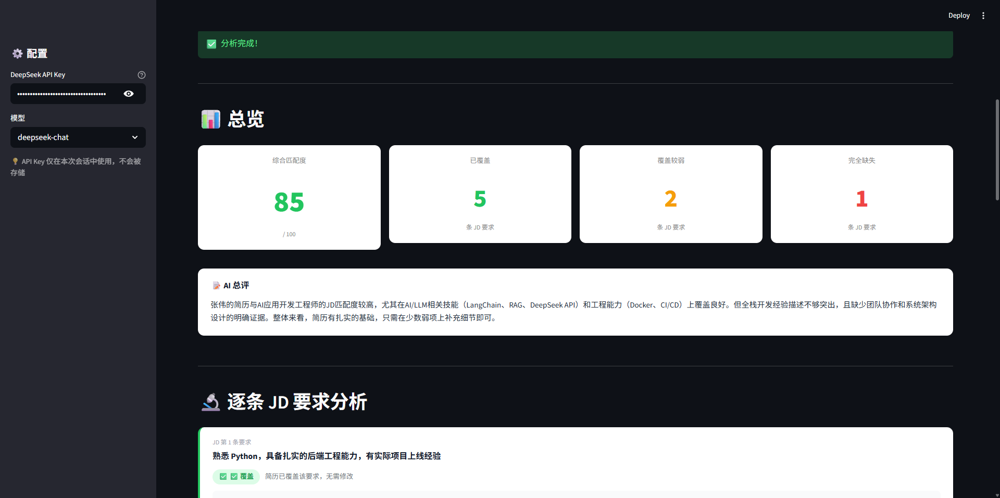
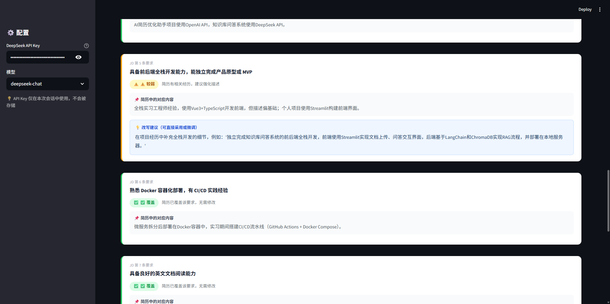

# JD Gap Analyzer

> **SpeedyJob JD 匹配功能改进版 MVP**  
> 逐条拆解 JD 要求 · 精准定位简历短板 · 给出可直接使用的改写建议


---

## 📸 效果预览





---

## ✨ 核心功能

SpeedyJob 现有 JD 匹配只给一个综合分，**本项目做到逐条分析**：

| 功能 | SpeedyJob 现有 | 本项目改进 |
|------|---------------|-----------|
| JD 分析颗粒度 | 整体分数 | **逐条拆解每项要求** |
| 建议可操作性 | 模糊方向 | **直接给出改写文字** |
| 覆盖状态判断 | 无 | **✅覆盖 / ⚠️较弱 / ❌缺失** |
| 简历证据定位 | 无 | **指出对应哪段经历** |

## 🚀 快速启动

```bash
# 克隆项目
git clone <repo-url>
cd jd-gap-analyzer

# 安装依赖
pip install -r requirements.txt

# 运行
streamlit run app.py
```

打开浏览器 http://localhost:8501，在左侧输入 DeepSeek API Key，粘贴简历和 JD 即可。

## 🔑 获取 API Key

访问 [platform.deepseek.com](https://platform.deepseek.com) 注册，每次分析成本约 ¥0.01。

## 📁 项目结构

```
jd-gap-analyzer/
├── app.py               # Streamlit 主应用
├── requirements.txt     # 依赖
├── improvement_note.md  # 改进方案说明
└── README.md
```

## 📋 使用流程

1. 左侧边栏输入 DeepSeek API Key
2. 左侧粘贴简历文本
3. 右侧粘贴目标 JD
4. 点击「开始深度分析」
5. 查看逐条分析结果和改写建议

## 🛠️ 技术栈

- **前端**：Streamlit（零部署成本，本地即可运行）
- **AI**：DeepSeek Chat API（结构化 JSON 输出）
- **语言**：Python 3.8+

---

*全程使用 Vibe Coding 方式开发，详见 improvement_note.md*
